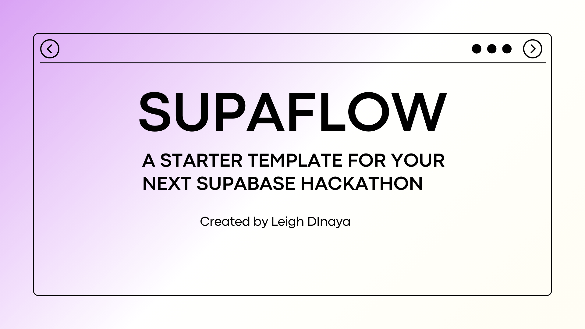

# SupaFlow

SupaFlow - a Nuxt 3 starter template for your next Supabase hackathon.

Built with Nuxt 3, ShadCN-Vue and Supabase. Deployed on Vercel.



This template combines the power of Nuxt 3 with a stack of essential libraries to accelerate your development process.

## Features

### User Authentication

- **Supabase:** Utilize the secure and scalable Supabase authentication system for seamless user registration and login.

### Profile Management

- **User Profile:** Implement a user profile system with customizable fields to manage user information.

### Enhanced Readability

- **Composables:** Leverage Vue composition functions to enhance code readability, maintainability, and reusability.

### Frameworks and Libraries

- **Nuxt 3:** The core of your application, providing a powerful Vue.js framework with improved performance and a modular structure.
- **ShadCN Vue:** A sleek and customizable UI library to add a touch of elegance to your authentication and profile components.
- **Tailwind CSS:** Rapidly build modern, responsive designs with the utility-first CSS framework.
- **Vueuse:** A collection of essential Vue composition functions for supercharging your application logic.

### Form Validation

- **Zod:** A robust TypeScript-first schema declaration and validation library to ensure data consistency.
- **VeeValidate:** Powerful form validation library for Vue.js to keep your forms in check.

### Database

- **Supabase:** The open-source alternative to Firebase, providing a real-time database and authentication system.

### Styling and Theming

- **Google Fonts:** Easily integrate and use a variety of beautiful and free fonts in your application.
- **Color Mode:** Enable a dark mode or light mode for your users to customize their visual experience.

### Testing

- **Vitest:** A lightweight and fast test runner for Vue.js applications, ensuring your codebase remains robust.

## Getting Started

1. **Clone the Repository:**

   ```bash
   git clone https://github.com/leighayanid/supaflow.git
   cd supaflow
   ```

2. **Install Dependencies:**

   ```bash
   npm install
   ```

3. **Configure Supabase:**

   - Set up a Supabase project and replace the configuration in `.env` with your own API key and URL.

   ```bash
     SUPABASE_URL=
     SUPABASE_KEY
   ```

4. **Run the Development Server:**

   ```bash
   npm run dev
   ```

5. **Open Your Browser:**
   Visit [http://localhost:3000](http://localhost:3000) to see your Supaflow starter template in action.

## Customization

### Theming

- **Google Fonts:**

  - Replace the font inside `nuxt.config.ts` file to include your preferred Google Fonts.

- **Color Mode:**
  - Customize the color modes in `tailwind.config.js` to match your application's aesthetics.

### UI Components

- **ShadCN Vue:**
  - Explore and customize the UI components in the `components/ui` directory.

### Application Logic

- **Vueuse:**
  - Leverage the power of Vue composition functions for your specific application needs.

### Authentication and Profile

- **Supabase:**
  - Configure Supabase authentication and customize the user profile management in the `auth` and `profile` directories.

### Testing

- **Vitest:**
  - Write tests for your components and logic in the `tests` directory.

## Contributing

Found a bug or have a suggestion? Contributions are welcome! Please open an issue or submit a pull request.

## License

This project is licensed under the MIT License - see the [LICENSE](LICENSE) file for details.

---

Happy coding! 🚀
